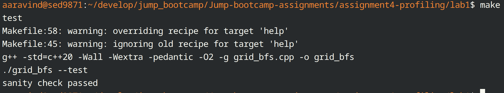

# Intro Profiling Lab Report

## 1. Optimizations Made

Changed the order in which compute_congestion_pressure access to row major ordering. 

Used unique pointer and added delete statements to remove all memory leaks. 

## 2. Methodology Walkthrough

All files are already in folder. A few interesting stats
compute_congestion_pressure had 22% self time before and after optimization decreased to 18%. 

Overall time decreased from 3.7s to 1.7s. 

## 3. Correctness Evidence

grid = 260 x 260
open_cells = 51260
requests = 1200
reachable = 1177
unreachable = 23
average_distance = 180.575
route_label_checksum = 3703473789245134517
heatmap_total_visits = 32914184
heatmap_active_cells = 51041
heatmap_max_visits = 957
heatmap_threshold_checksum = 17645577948039157950
congestion_passes = 4096
congestion_total_pressure = 3719781
congestion_max_pressure = 175
congestion_pressure_checksum = 5595025244828244209
time_sec = 1.38748

## 4. Conceptual Questions

Q1.1: In the time command output, why does user + sys not always equal real?

One good way to think about this would be as follows. The real time is a stop watch, that measures how much time it has elapsed from when the program started to when it ended. This includes all measurements, including but not limited to I/O and time spent not doing anything. But user measures only the time the CPU spends on the application code and sys only measures the time the CPU spent on the kernel space for the particular program. So factors like I/O and multi-threading dont apply to sys+user but do for real.    

Q2.1: In perf stat, how are event counts and derived metrics such as insn per cycle, % of all branches, and % of all cache refs calculated?

perf stat uses the PMU and hardware counters to count stats like cache misses and more. Once these are obtained, it uses mathematical formula to calculate and display these. 

Q2.2: What do the right-side percentages in parentheses mean in perf stat, for example (24.94%)?

These represent multiplexing. Sometimes, when the number of events we are tracking is greater than the number of hardware counters we have, the PMU switches between these counters, measuring cache misses for sometime before going to some other metric. The percentage measures how much time, was spent on each metric.

Q2.3: Is a number like 390722434 cache-misses always the exact number of cache misses? Explain why or why not.

No, first reason is multiplexing as mentioned above. Then, we also have the fact that OS has background processes that can cause these issues. We also have the fact that sometimes wrong branch predictions can cause cache misses or so on. 

Q3.1: What are frame pointers, and how does perf -g use them to reconstruct call stacks?

Every function has a stack frame, which is a space on the stack dedicated for the frame. The frame pointer points to the top of the stack for each function so that the function knows its boundary. The frame pointers are linked together, because the top of the stack is generally the frame pointer of the caller. Hence, perf -g checks this to determine which function called which function.

Q3.2: What is the difference between inclusive cost and self cost in perf report, gprof, or Callgrind?

Inclusive cost is the time spent on the instructions that are directly under the function, excluding any children. self cost takes the total time spent, including any children functions. 

Q4.1: How is gprof able to give function call counts and the number of times one function is called by another? Give a high-level explanation of how it works under the hood.

Gprof uses instrumentation sampling. Essentially, when you compile a program using the -pg flag, it causes the compiler to insert special functions inside the executable that counts the number of times each function is called. 

Q4.2: If perf and FlameGraphs give strong runtime hotspot data, why use gprof in this lab?
Perf and flamegraphs both use sampling profiling, where the program is stopped multiple times and checked where it is. This is not entirely deterministic nor accurate as samples are taken only in intervals. However, gprof uses instrumentation profiling, so provides exact counts. 

Q5.1: Compare Valgrind Memcheck and AddressSanitizer. When would you use each one?
Valgrind runs the code in a sandbox. It emulates a cpu and evalutes the memory used and freed there. This heavily slows the executable down. address sanitizer on the other hand adds code during compilation to check for free. This does not slow the system down. 

Valgrind can be used when there is an executable file only as it only needs the binary. it also detects unintialized reads.

Address sanitizer can be used when the program is already slow or bloated as it does not slow it down heavily. 

Q6.1: Did any tool disagree with another tool? If yes, explain whether it is a real contradiction or a difference in measurement method.

Gprof mentions inbuilt cpp operators as primary hotspots while perf omits them. One reason could be that compiler optimizations are not enabled on gprof while they were on perf. The fact that gprof introduces extra code could also be a reason.